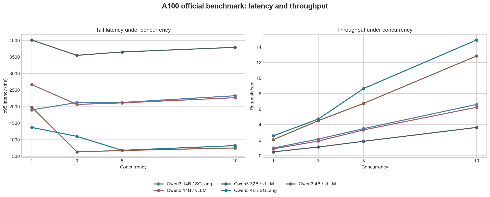
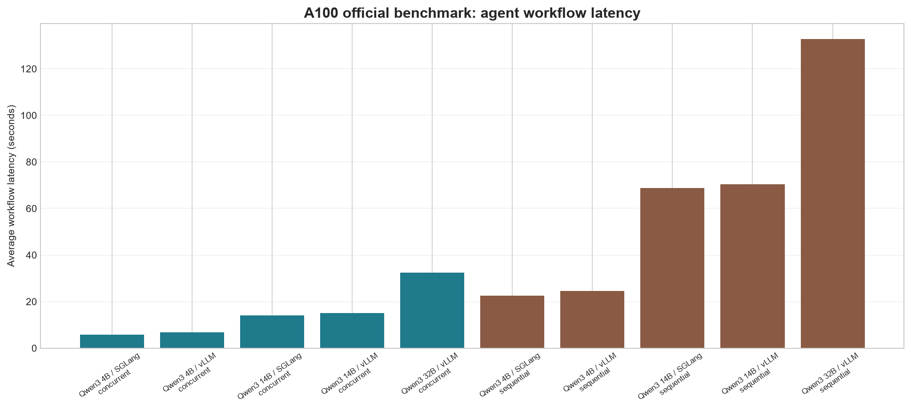
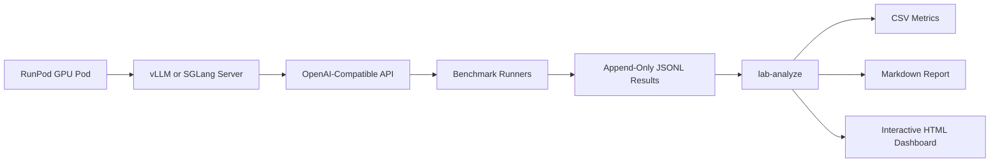

# LLM Inference Lab

[](https://github.com/PranayS676/llm-inference-lab/actions/workflows/ci.yml)


[](LICENSE)


A RunPod-first lab for learning, running, and analyzing local LLM inference
experiments with OpenAI-compatible servers.

The project answers one practical engineering question:

> Which model, inference engine, and GPU setup is best for a 5-10 agent workload?

This is not a chatbot app. It is an inference experimentation harness for
benchmarking model serving behavior: latency, throughput, TTFT, concurrency,
agent workflow latency, and GPU pressure.

## Current Benchmark Snapshot

The first committed real benchmark run was completed on a RunPod
`NVIDIA A100-SXM4-80GB` pod using Qwen3 models, vLLM, and SGLang.

| Artifact | Link |
| --- | --- |
| Interactive dashboard | [dashboard.html](experiment_runs/a100-20260628T202440Z/analysis/dashboard.html) |
| Deep analysis report | [analysis_report.md](experiment_runs/a100-20260628T202440Z/analysis/analysis_report.md) |
| Raw result JSONL files | [results](experiment_runs/a100-20260628T202440Z/results) |
| Run manifest | [BENCHMARK_MANIFEST.md](experiment_runs/a100-20260628T202440Z/BENCHMARK_MANIFEST.md) |

Headline findings from the official A100 run:

- Official benchmark rows analyzed: `695`
- Non-official smoke rows excluded from analysis: `1`
- Official benchmark errors: `0`
- Highest request throughput: `Qwen3 4B / SGLang` at concurrency `10`, `14.91 req/sec`
- Lowest p95 latency: `Qwen3 4B / vLLM` at concurrency `3`, `632.6 ms`
- Fastest average agent workflow: `Qwen3 4B / SGLang`, concurrent mode, `5.78 sec`
- For common 4B/14B models at concurrency `10`, SGLang averaged `1.11x`
  vLLM request throughput and `1.06x` vLLM p95 latency.

## Benchmark Visuals

These visuals are generated from the committed official A100 analysis CSVs.
Open the interactive dashboard for the full filterable view.





## What This Lab Teaches

- How TTFT changes perceived responsiveness.
- How p50 and p95 latency diverge under concurrency.
- How requests/sec and tokens/sec move as model size increases.
- How vLLM and SGLang behave under the same model and workload.
- How Qwen3 4B, 14B, and 32B trade latency, throughput, and agent utility.
- Why one loaded model should be treated as one server run.
- How sequential agent workflows compare with concurrent agent fanout.
- How to capture raw benchmark evidence and convert it into reusable reports.

## Experiment Matrix

| Dimension | Current coverage |
| --- | --- |
| GPU | A100-SXM4-80GB |
| Engines | vLLM, SGLang |
| Models | Qwen3 4B, Qwen3 14B, Qwen3 32B |
| vLLM coverage | Qwen3 4B, 14B, 32B |
| SGLang coverage | Qwen3 4B, 14B |
| Concurrency | 1, 3, 5, 10 |
| Workloads | single prompt, batch, concurrency matrix, sequential agents, concurrent agents |
| Planned | H200 long context, SGLang 32B, repeated runs, continuous GPU telemetry |

## Metrics

| Metric | Meaning |
| --- | --- |
| `p50_latency_ms` | Median request latency. Useful for the typical request. |
| `p95_latency_ms` | Tail latency. Critical for interactive agents and user experience. |
| `requests_per_second` | Throughput for a run at a given concurrency level. |
| `tokens_per_second_est` | Client-estimated generation speed. Directional until engine-native metrics are added. |
| `ttft_ms` | Time to first token. Lower values feel more responsive. |
| `error_rate` | Failed request share for a benchmark group. |
| `workflow_latency_ms` | End-to-end latency for a multi-agent workflow. |
| `gpu_memory_used_mb` | Point-in-time GPU memory snapshot from summary checkpoints. |
| `scaling_efficiency_pct` | Observed throughput scaling compared with ideal linear scaling from concurrency 1. |

## Architecture



## Repository Layout

```text
src/runpod_inference_lab/   Python package and CLI entrypoints
configs/                    GPU, model, engine, and benchmark configs
prompts/                    JSONL task suites
servers/                    vLLM/SGLang start, health, and stop scripts
scripts/                    A100/H200 benchmark orchestration scripts
tests/                      Local tests that do not require a GPU
docs/                       RunPod runbooks, troubleshooting, and image assets
experiment_runs/            Sanitized committed benchmark runs
results/                    Local raw JSONL output, ignored except .gitkeep
reports/                    Local generated reports, ignored except .gitkeep
```

## Local Setup

Install `uv`, then run:

```powershell
uv sync --group dev
uv run pytest
uv run ruff check .
uv run ruff format --check .
```

Local tests use fake data and do not require a GPU, a model server, or RunPod
credits.

## Environment

Copy `.env.example` to `.env` if you want local defaults:

```bash
OPENAI_BASE_URL=http://127.0.0.1:8000/v1
OPENAI_API_KEY=dummy
MODEL_NAME=Qwen/Qwen3-4B
PROVIDER=runpod
GPU_NAME=A100_80GB
ENGINE=vllm
RUN_TAG=dev
CHAT_TEMPLATE_ENABLE_THINKING=false
```

Do not commit real API keys, Hugging Face tokens, RunPod tokens, or `.env`
files.

## RunPod A100 Quick Start

On a fresh RunPod pod:

```bash
cd /workspace
git clone https://github.com/PranayS676/llm-inference-lab.git
cd llm-inference-lab
bash scripts/setup_runpod.sh
source .venv/bin/activate
```

`setup_runpod.sh` pins vLLM to a Torch 2.8-compatible release for the RunPod
PyTorch 2.8 / CUDA 12.8 image and caps Transformers below 5 for vLLM tokenizer
compatibility. Override `VLLM_VERSION` or `TRANSFORMERS_CONSTRAINT` only when
you are intentionally testing a newer RunPod image or driver.

Start vLLM:

```bash
export MODEL_NAME=Qwen/Qwen3-4B
export OPENAI_API_KEY=dummy
export MAX_MODEL_LEN=32768
bash servers/start_vllm.sh
```

In a second terminal:

```bash
cd /workspace/llm-inference-lab
source .venv/bin/activate
export OPENAI_BASE_URL=http://127.0.0.1:8000/v1
export OPENAI_API_KEY=dummy
export MODEL_NAME=Qwen/Qwen3-4B
export GPU_NAME=A100_80GB
export GPU_MEMORY_GB=80
export ENGINE=vllm
export CHAT_TEMPLATE_ENABLE_THINKING=false

bash servers/health_check.sh
uv run lab-single
bash scripts/run_a100_baseline.sh
```

Stop the model server before switching models or closing the pod:

```bash
bash servers/stop_servers.sh
```

## Model Switching Rule

One loaded model equals one server run.

Do not compare Qwen 4B, 14B, and 32B by changing only `MODEL_NAME` in the
client shell. To benchmark a different model:

```bash
bash servers/stop_servers.sh
export MODEL_NAME=Qwen/Qwen3-14B
bash servers/start_vllm.sh
bash servers/health_check.sh
uv run lab-single
bash scripts/run_a100_baseline.sh
```

This keeps model, server, and result metadata aligned.

## Main Commands

```bash
uv run lab-single
uv run lab-batch --prompt-file prompts/simple_tasks.jsonl --max-tasks 10
uv run lab-concurrency --prompt-file prompts/simple_tasks.jsonl --concurrency 5 --max-tasks 25
uv run lab-agent-workflow --max-tasks 2
uv run lab-agent-concurrent --max-tasks 2
uv run lab-long-context generate --target-tokens 8000 --target-tokens 32000
uv run lab-long-context run --prompt-file prompts/generated_long_context_tasks.jsonl
uv run lab-summarize --input-file results/concurrency_results.jsonl --output-csv results/summary.csv
uv run lab-report --results-dir results --output-file reports/hardware_recommendation.md
uv run lab-analyze experiment_runs/a100-20260628T202440Z
```

## Analysis Workflow

`lab-analyze` reads an `experiment_runs/<id>/results` directory and writes
performance-only analysis artifacts into `experiment_runs/<id>/analysis`.

Generated artifacts:

- `dashboard.html`: interactive Plotly dashboard.
- `analysis_report.md`: learning-oriented and benchmark-oriented written analysis.
- `summary_metrics.csv`: official row counts by run tag and run type.
- `concurrency_metrics.csv`: p50, p95, requests/sec, tokens/sec, TTFT, and errors.
- `scaling_metrics.csv`: throughput scaling efficiency by concurrency.
- `engine_comparison.csv`: SGLang/vLLM ratios where both engines exist.
- `agent_metrics.csv`: sequential and concurrent workflow latency.
- `agent_step_metrics.csv`: per-agent step latency.
- `workload_metrics.csv`: workload and category breakdown.
- `gpu_snapshots.csv`: structured GPU memory/utilization checkpoints.

By default, `lab-analyze` includes only run tags ending in `-official`. Use
`--include-non-official` only when you intentionally want smoke or ad hoc rows
included in the analysis.

## Result Policy

Raw local result files are append-only JSONL and are ignored by git by default:

```text
results/*.jsonl
reports/*.md
reports/*.csv
```

Commit benchmark outputs only when they are intentionally curated and sanitized
under `experiment_runs/<id>`. Before committing, run a targeted secret scan for
API keys, Hugging Face tokens, RunPod tokens, and local-only machine paths.

## Testing Standards

Before pushing code or committed benchmark artifacts:

```powershell
uv run ruff check .
uv run ruff format --check .
uv run pytest
uv lock --check
```

When validating generated analysis artifacts, also check:

- official-only filtering excludes smoke rows,
- row counts match the manifest,
- dashboard JavaScript is syntactically valid,
- generated reports do not contain secrets or machine-local paths.

## Documentation

- [Experiment Design](docs/EXPERIMENT_DESIGN.md)
- [RunPod A100 Runbook](docs/RUNPOD_A100_RUNBOOK.md)
- [H200 Long Context Runbook](docs/H200_LONG_CONTEXT_RUNBOOK.md)
- [Troubleshooting](docs/TROUBLESHOOTING.md)

## Roadmap

- Run H200 long-context experiments.
- Add SGLang Qwen3 32B comparison.
- Add repeated official runs for variance estimates.
- Add continuous GPU telemetry during benchmark execution.
- Add engine-native metrics for scheduler, KV cache, and token accounting.
- Add quality-scored benchmark prompts beyond basic validity checks.
- Add optional cost analysis after performance methodology is stable.
